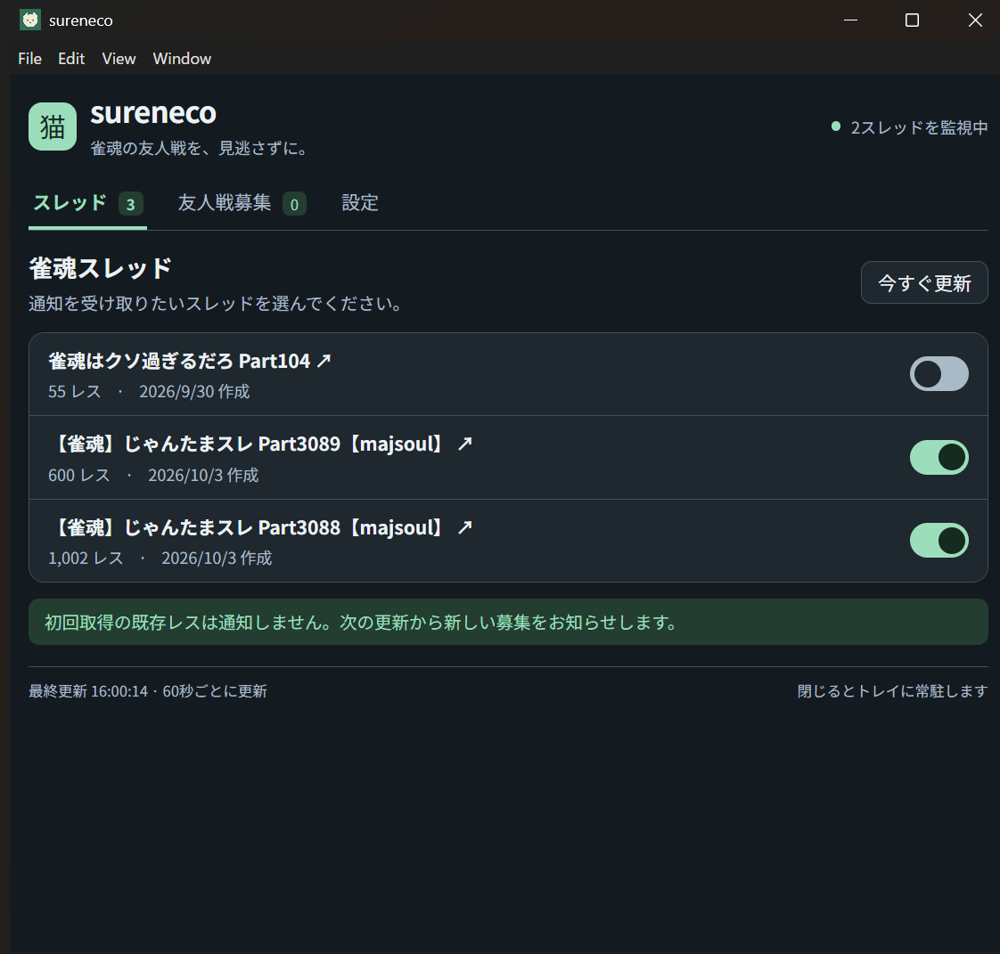

# sureneco


5ch麻雀板の雀魂スレッドから友人戦募集を通知する、Windows / Ubuntu向け常駐アプリです。Electron + TypeScript + Reactで実装しています。



## 開発

Node.js 22.12以上とpnpmを用意してください。

```sh
pnpm install
pnpm exec install-electron
pnpm dev
```

`pnpm exec install-electron`はElectron本体を取得します。`pnpm dev`でViteとElectronを起動します。メインプロセスとpreloadを変更したときは開発コマンドを再起動してください。`pnpm check`でテスト、型チェック、ビルド、テーマ診断を実行します。

```sh
pnpm build
pnpm start
```

Windows用のNSISインストーラーとZIP版は、WindowsのPowerShellで同時に作成します。

```powershell
pnpm package:win
```

release/にインストーラー（.exe）とZIP（.zip）を出力します。ZIP版は全ファイルを展開し、sureneco.exeを起動してください。設定の保存先はインストール版と同じuserDataディレクトリです。

Linux用AppImage / debはUbuntu上で作成します。

```sh
pnpm package:linux
```

WindowsからLinux用配布物を作る場合は、WSLのUbuntuやLinuxコンテナー内で実行してください。WSLではUbuntu側のホームディレクトリにリポジトリを配置し、Linux側で`pnpm install`してから`pnpm package:linux`を実行します。Windows側のnode_modulesは共有しません。Dockerを使う方法は[electron-builderの公式手順](https://www.electron.build/docs/features/multi-platform-build/)を参照してください。プロジェクトで必要なNode.jsは22.12以上です。

パッケージはrelease/に出力します。v0.2.0のファイル名は次の形に統一します。

- `sureneco_v0.2.0_amd64.deb`
- `sureneco_v0.2.0.AppImage`
- `sureneco_v0.2.0_Setup.exe`
- `sureneco_v0.2.0_win.zip`

同じOS・CPU・Electronバージョン向けのパッケージ作成では、インストール済みElectronをコピーして使用します。[公式のelectronDist設定](https://www.electron.build/docs/configuration/#electrondist)を使い、`win-unpacked.tmp`や`linux-unpacked.tmp`の名前変更時に発生するEPERMを避けるための処理です。別OS・CPU向けには流用しません。

更新後は通常の`pnpm package:win`または`pnpm package:linux`を再実行してください。引き続きEPERMが出る場合は新しいログで失敗箇所を確認します。パッケージ作成中は配布物や並行ビルドを終了してください。ファイル使用中・アクセス権・セキュリティソフトのどれが原因かは、元のログだけでは断定できません。

## 使い方

スレッド一覧のトグルをオンにすると監視します。初回は既存レスを基準にし、次の更新から新しい募集を通知します。更新間隔の初期値は20秒で、設定画面から20秒以上の整数に変更できます。保存済みの更新間隔はそのまま使います。設定で検出用正規表現、NG本文・ID・ワッチョイも変更できます。NGは一行一件で入力します。「通知を許可するワッチョイ」に一行一件で指定すると、完全一致する投稿者の募集だけを通知します。空欄なら全投稿者が対象です。NG設定が優先され、募集一覧には通知対象外の募集も表示されます。5桁のルームIDが本文にも参照先にもないレスは募集として扱いません。本文にIDがない場合は、`>>レス番号`で指定された過去レスをたどります。締め切り済み・期限切れの募集への返信は通知しません。期限は設定の`emphasis_sec`で判定し、返信によって延長しません。募集本文または「参照先のルームID」の5桁の番号をクリックするとクリップボードにコピーできます。全角数字は半角にしてコピーします。「レスを開く」でブラウザーから該当レスを開けます。

通知をクリックするとアプリを再表示し、最小化中なら復元します。Windowsでは通知用の起動先を登録します。開発モードと配布版は別の登録先を使います。

終了時のウィンドウサイズ・位置・最大化状態を記憶し、次回起動時に復元します。モニター構成が変わった場合は画面内に補正します。UbuntuのWayland環境では位置の復元がOSに制限される場合があります。

ウィンドウを閉じるとトレイに常駐します。終了はトレイメニューから選択してください。Ubuntuではトレイを表示できるデスクトップ環境が必要です。トレイを作成できない場合はウィンドウを閉じると終了します。OSの通知設定によって通知が表示されない場合があります。

設定と取得済みレス番号はElectronのuserDataディレクトリに保存します。通信失敗は画面に表示され、次回更新で再試行します。5ch側のアクセス制限や形式変更で取得できない場合があります。

設定画面の「アプリの更新」で現在のバージョンと更新状況を確認できます。配布版は起動時と6時間ごとにGitHubの正式リリースを確認し、新版を通知します。NSIS・AppImage・DEB版では「ダウンロード」→「再起動して更新」で更新できます。DEB版はOSの認証が必要です。Windows ZIP版はリリース画面から手動で更新します。開発実行では更新を無効にします。

リリースを公開する際は、配布ファイルと一緒に生成された`latest.yml`、`latest-linux.yml`、`.blockmap`もGitHub Releasesへ添付してください。ローカルのpackageコマンドは公開せず、ファイル生成だけを行います。この機能を含む版を一度手動導入すれば、次の新しいバージョンからアプリ内で更新できます。

詳細は[仕様書](docs/specification.md)を参照してください。

## 更新履歴

### [2026/10/06] v0.3.0

- 指定したワッチョイの募集だけを通知する設定を追加。
- ウィンドウサイズ・位置・最大化状態の保存と復元を追加。

### [2026/10/05] v0.2.1

- ウィンドウの最小幅を400pxに変更し、狭い画面の表示を調整。
- 更新間隔の初期値と下限を20秒に変更。設定画面から変更可能。

### [2026/10/04] v0.2.0

- GitHubリリースの更新通知と、インストール版・AppImage版のアプリ内更新を追加。
- 配布ファイル名の接頭辞を`sureneco_vバージョン`に統一。
- 友人戦募集カードの上部にレス番号を明示。
- 画面全体の余白と一覧・設定欄の高さを抑え、GUIをコンパクトに調整。
- 締め切り済み・期限切れの募集への返信通知を抑止。
- Windows通知の起動先を明示し、クリックでアプリを復元する処理と既定画面用ファイルの除去を追加。
- デフォルトの友人戦通知フィルタに`数字+東|南`を追加

### [2026/10/04] v0.1.0

- スレッド選択、募集通知、締め検出、NG設定、トレイ常駐を実装。
- Windows / Ubuntu向けビルド設定と検証コマンドを追加。
- 募集本文の5桁のルームIDをクリックでコピーする機能を追加。
- 募集検出の初期値に「四東・四南・三東・三南」と5桁の番号を含む条件を追加。
- 初期フィルタに3・4、III・IV、Ⅲ・Ⅳと東・南を組み合わせた表記を追加。
- 募集判定に5桁のルームIDを必須とし、レス参照をたどってIDを取得できるように変更。
- 同じ環境向けのパッケージ作成で展開済みElectronを使用し、ZIP展開後のフォルダー名変更を回避。
- Windows用インストーラーとZIP版の同時生成に対応。

### [2026/10/04] v0.0.0

- リポジトリを作成。
